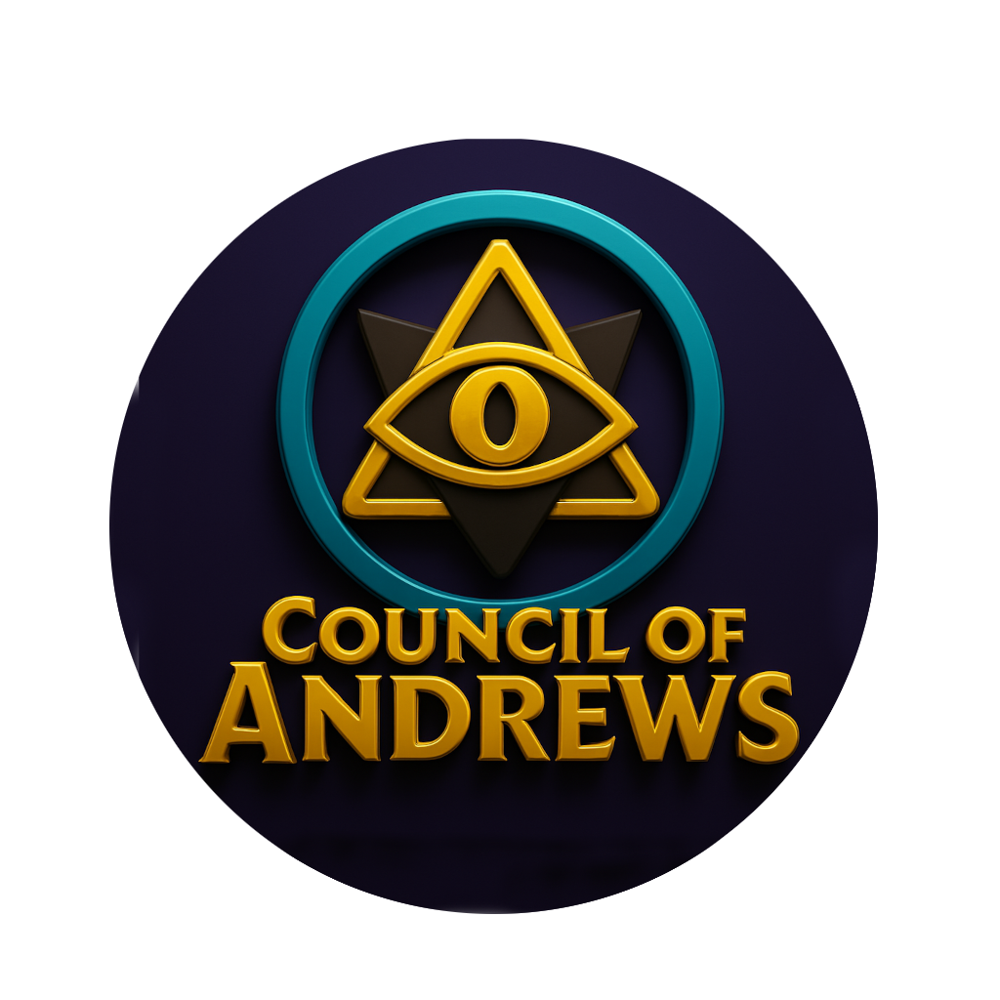

# Drew of the Hill

  
  <h3>A prestigious interdimensional game for the Council of Andrew across the multiverse</h3>
  
  

## 🌀 About Drew of the Hill

Drew of the Hill is an interdimensional competitive game where Andrews across the multiverse battle to reign as the "One True Drew." Inspired by the Council of Ricks (but for Andrews), this game tracks which player has claimed "The Hill" and how long they've maintained their reign of dimensional dominance.

The core concept is simple but addictively competitive:
1. Register your Andrew designation (e.g., "Drew C-137")
2. Claim The Hill by clicking the button
3. Your reign timer starts counting up immediately
4. Other Andrews can dethrone you by claiming The Hill
5. Every second counts toward your total time and possibly your longest reign

Your time is recorded on two leaderboards:
- **Total Time** - The cumulative time you've spent as the One True Drew
- **Longest Reign** - Your single longest uninterrupted period of dimensional dominance

## 🚀 Features

- **Real-time Competitive Gameplay**: Instantly see when someone claims The Hill, with live-updating timers
- **Dual Leaderboards**: Compete on both total time and longest single reign
- **Interdimensional Portal Design**: Rick and Morty-inspired UI with portal effects and animations
- **Persistent Stats**: Your achievements are recorded permanently in the Firebase Realtime Database
- **Multiverse Identity**: Register your unique variant designation to be recognized across dimensions

## 🎮 How to Play

1. Visit [Drew of the Hill](https://rorrimaesu.github.io/DrewOfTheHill/) in your browser
2. Enter your Andrew designation (your variant name in the multiverse)
3. Click the glowing "Become the One True Drew!" button to claim The Hill
4. Watch your reign timer count up in real-time
5. Come back regularly to reclaim The Hill when another Drew dethrones you
6. Check the leaderboards to see where you rank in the multiverse

## 🔮 The Council of Andrew Manifesto

> "This multiverse can be a scary place, this is a safe haven for Andrews all over this Youniverse C-137 & beyond.
>
> We are Andrews of all sorts; so long as your name is Andrew or any recognized variation of it, you are welcome & encouraged to come home to your inner Andrew.
>
> We are Andrew, We are One Observer beyond SpaceTime experiencing infinite realities simultaneously."
>
> — The Council of Andrew

## 🧪 Technology

Drew of the Hill is built using:
- **Frontend**: HTML5, CSS3, JavaScript (ES6+)
- **Backend**: Firebase Realtime Database
- **Animations**: Custom CSS animations and transitions
- **Design**: Rick and Morty-inspired portal effects and sci-fi UI

## 🥇 Current Champions

As of April 6, 2025, these remarkable Andrew variants have established interdimensional dominance:

- **Drew C-137** - Currently holding the record for longest continuous reign (47 minutes)
- **Andy Quantum** - Highest cumulative time across multiple reigns
- **Andrew X-99** - Known for strategic hill claims during off-peak hours

*Will your designation appear at the top of the leaderboard?*

## 💬 Join the Battle

The Council of Andrew welcomes all variants to participate in this prestigious competition. Whether you're a Drew, Andy, or any recognized Andrew variant, your place in the multiverse is waiting.

*"There are infinite Andrews across the multiverse, but only one can be the True Drew at any given moment. Will it be you?"*

## 🔥 Fuel Interdimensional Research

  <a href="https://buymeacoffee.com/rorrimaesu" target="_blank">
    
    <h3>Power the Interdimensional Portal Network</h3>
  </a>

The Council of Andrew's interdimensional portal technology requires constant maintenance and exotic matter to continue functioning across all realities. Your support directly powers the interdimensional servers that keep Drew of the Hill operational across the multiverse.

**Why fuel our interdimensional research?**
- Ensures stable quantum entanglement between players
- Prevents catastrophic timeline collapse and dimensional drift
- Helps develop new features for cross-dimensional enjoyment
- Keeps the One True Drew's reign timer accurate across all possible realities

Every contribution, no matter the size, supports a universe where Andrews can safely compete for interdimensional glory!

## 📜 License

Drew of the Hill is sanctioned by the Council of Andrew across all timelines and is provided under the [Council of Andrew Interdimensional License](LICENSE).

---

  <i>Developed and maintained by the Council of Andrew Technical Division</i> 
  <i>© 2025 Council of Andrew | All rights reserved across dimensions C-137 and beyond</i>

